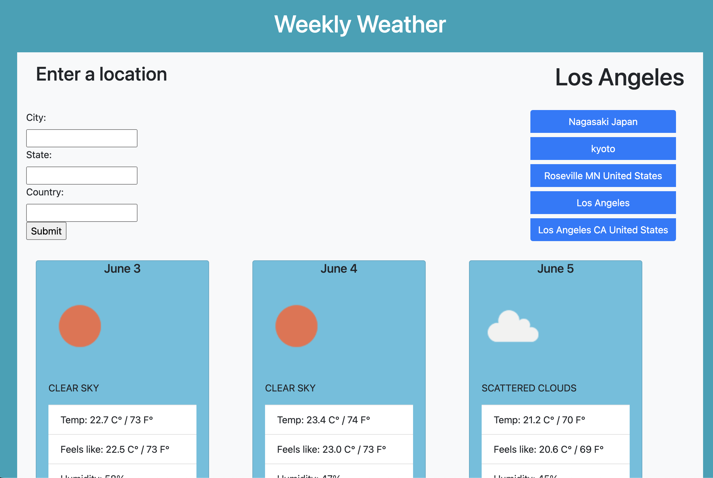
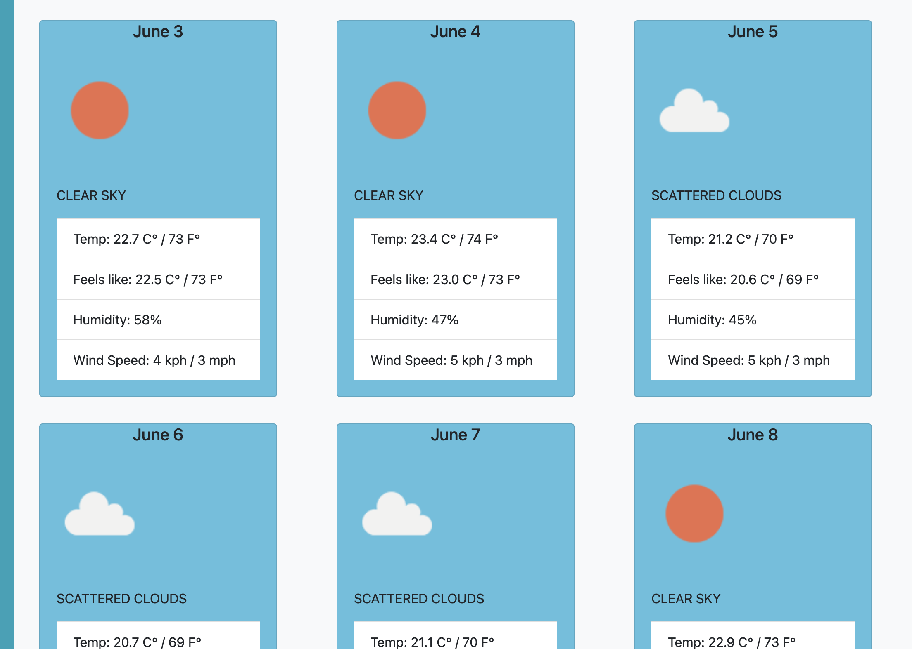

# Weather-Dashboard

## Description

I was motivated to make a simple and usable weather application, because so many weather websites these days are buggy, slow, and infested with ads. This website is not meant to be a all-encompassing information center, but rather it is meant to give the everyday user a quick update on what to expect for the day or weekend trip. 

Though the app works well, I am far enough along in my journey to see that there are better ways to display the data. The JavaScript does nearly everything, and it makes the app slower than it could be with a template like Handlebars.js. 

The search function utilizes two APIs: A geocoding API that converts city, state, and country into coordinates, and a weather API that takes in the coordinates and returns all the data for that area. The page then displays the current day and five days into the future. 

## Table of Contents

- [Installation](#installation)
- [Usage](#usage)
- [Credits](#credits)
- [License](#license)
- [Features](#features)

## Installation

No Installation necessary, simply visit: https://andrewnalley.github.io/weather-dashboard/

## Usage

The page is fairly easy to use. Simply enter the city or town in which you would like to know the future weather. Sometimes you may need to be specific if the city name is commonly used; enter the state and country if it can't find the location. 

You can click on a previously searched city at the right-hand side of the page. 

Screenshots:

## Credits

Weather API: 
https://openweathermap.org/current#geo

API that converts City and country to coordinates:
https://api-ninjas.com/api/geocoding

Forms: 
https://www.w3schools.com/html/html_forms.asp

Cards: 
https://getbootstrap.com/docs/4.0/components/card/  

Append:
https://www.javascripttutorial.net/javascript-dom/javascript-append/

Loading text: 
https://codepen.io/alvarotrigo/pen/NWvQObB

## License

MIT License

Copyright (c) 2023 Andrew Nalley

Permission is hereby granted, free of charge, to any person obtaining a copy
of this software and associated documentation files (the "Software"), to deal
in the Software without restriction, including without limitation the rights
to use, copy, modify, merge, publish, distribute, sublicense, and/or sell
copies of the Software, and to permit persons to whom the Software is
furnished to do so, subject to the following conditions:

The above copyright notice and this permission notice shall be included in all
copies or substantial portions of the Software.

THE SOFTWARE IS PROVIDED "AS IS", WITHOUT WARRANTY OF ANY KIND, EXPRESS OR
IMPLIED, INCLUDING BUT NOT LIMITED TO THE WARRANTIES OF MERCHANTABILITY,
FITNESS FOR A PARTICULAR PURPOSE AND NONINFRINGEMENT. IN NO EVENT SHALL THE
AUTHORS OR COPYRIGHT HOLDERS BE LIABLE FOR ANY CLAIM, DAMAGES OR OTHER
LIABILITY, WHETHER IN AN ACTION OF CONTRACT, TORT OR OTHERWISE, ARISING FROM,
OUT OF OR IN CONNECTION WITH THE SOFTWARE OR THE USE OR OTHER DEALINGS IN THE
SOFTWARE.

## Features

- Utilizes local storage for search history
- Uses Bootstrap for cards 
- Requested search data gathered from APIs

